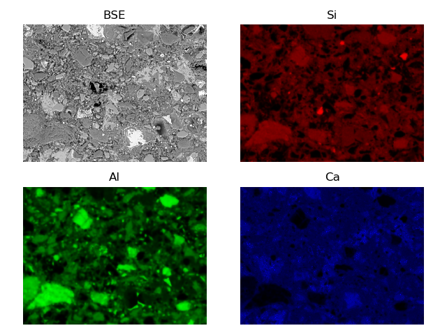
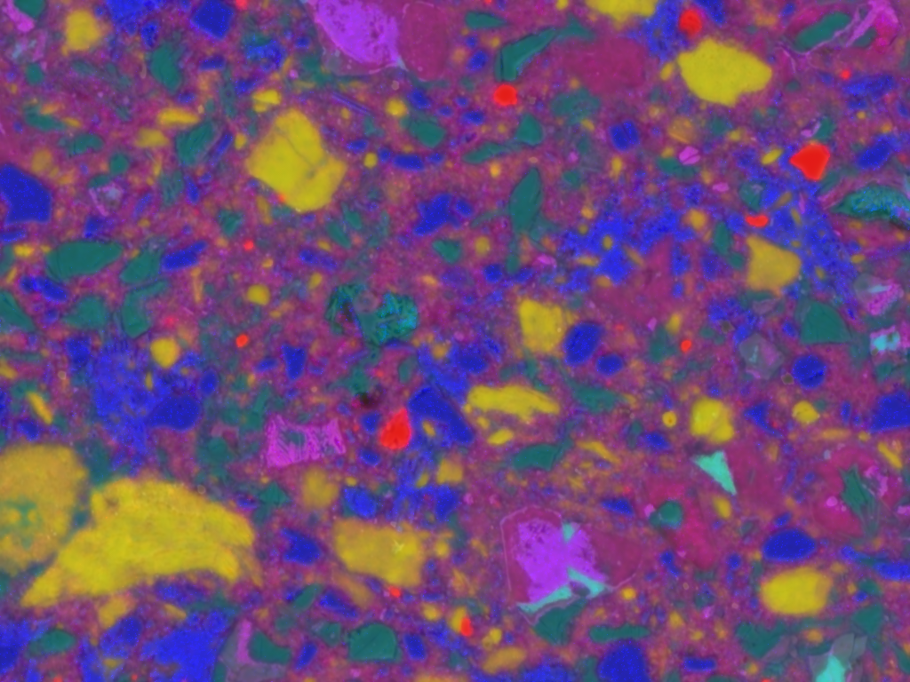
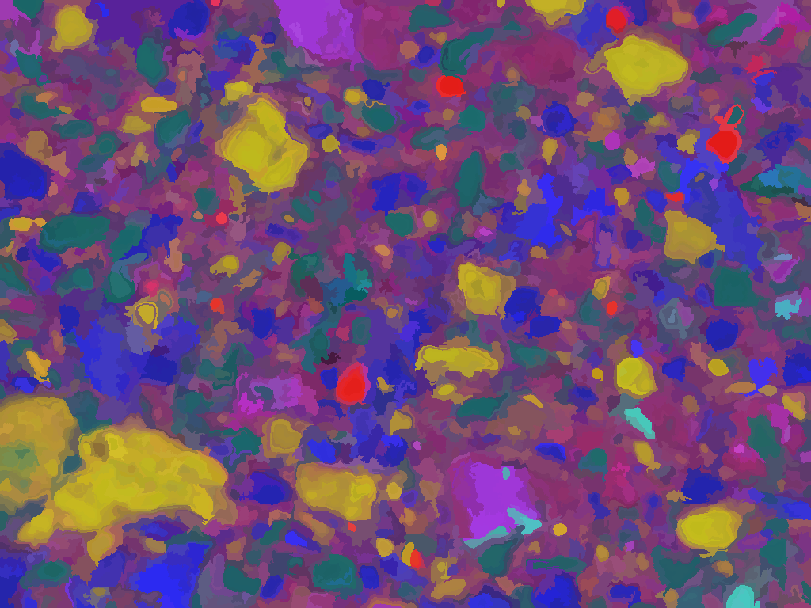
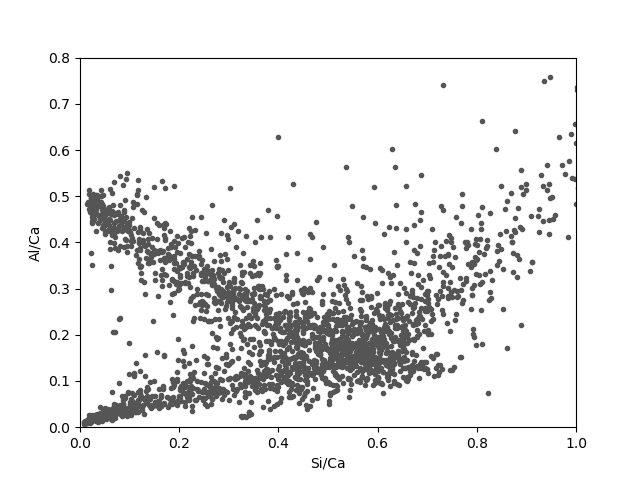

Main concepts 
=============

The main concept between edxia is the extraction of representative points from the map.
The representative points are extracted following these steps:

1. Loading the individual maps
2. Creation of a composite map
3. Segmentation of the composite maps, and extraction of representative points
4. Analysis of the representative points

Individual maps
---------------

The individual maps are loaded from the text-formatted quantified maps as provided by the microscope software.
The details are described in: :doc:`input_files`. 
The maps are then filtered according the parameters provided by the user.

    
    Individual component BSE/EDS maps

The composite map
-----------------

The individual maps are assigned a color as shown in the figure of `BSE/EDS components`_.
These maps are then assigned to the channels (Red, Blue and Green) of a RGB image (see for example the `Scikit-Image documentation`_).
Since only 3 color channels are available, 3 main components must be chosen. The following choice is quite common:

- **Red**: Si
- **Green**: Al
- **Blue**: Ca

An additional component (such as the BSE) can be used as an offset on all channels, or as a transparent overlay.
A `composite image`_ is obtained, the colors represent the mixture of phases.

    
    The composite image corresponding to the individual `BSE/EDS components`_.
    
    The colors corresponds to the following phases:
    
    - Blue: Portlandite/Calcite
    - Purple CSH/C2S/C3S
    - Green: AFm/C3A
    - Red: Quartz
    - Cyan: C4AF
    - Yellow: Metakaolin

    
The `composite image`_ can be used to quickly identify the phases present in the maps. Additional thresholding on the hue can provides a first estimation of the volume fraction of these phases. 
However, this method is limited because only 3 or 4 independant components can be analysed.

Segmentation
------------

The `composite image`_ is interesting because it allows to quickly define the region of similar composition in the map.
The pixels in the region of similar composition can be grouped to define "particles" or agglomeration of particles.
The gathering of pixels into larger region is the purpose of a segmentation algorithm. 
Many segmentation algorithms exist as seen on this `segmentation example`_ from the Scikit-image documentation.
By default in :py:mod:`edxia`, the [SLIC]_ algorithm is used.

    The segmented `composite image`_ using the [SLIC]_ algorithm.

    
Each region defined by the segmentation algorithm is assumed to be relatively uniform.
The most uniform point in the region is the point at the center, where the mixing effects are the lowest.
Therefore, the geometrical center of each center is used as a representative point of the maps.
The composition of these points are assembled into a dataset which can be further analysed.
    
Ratio plots
-----------

A simple analysis tools for EDS composition are ratio plots. 
These ratio plots are scatter plots where the axis are ratios of elemental composition (e.g. Si/Ca, Al/Ca, S/Ca, ...).
The position of the pure phases can be easily identify on this plots.
The points around these points acan be identified as being the respective phase.
Mixture lines can be defined between the position of two phases. 
Points along these lines corresponds to a mix of these two phases.
From this analysis, a researcher can detect the existence of a phase, or find the average composition of a variable phase (e.g C-S-H).

The main drawbacks of these ratio plots is that they do not display spatial information.
As such, an additional step is required to understand the distribution of phases on the maps.
This method was implemented as a plugin to the `Glueviz`_ software to answer this problem. This is described in the next section of the documentation: :doc:`glue`.

    
    
.. _Scikit-Image documentation: https://scikit-image.org/docs/stable/user_guide/numpy_images.html
.. _segmentation example: https://scikit-image.org/docs/stable/auto_examples/segmentation/plot_segmentations.html#sphx-glr-auto-examples-segmentation-plot-segmentations-py
.. [SLIC] Radhakrishna Achanta, Appu Shaji, Kevin Smith, Aurelien Lucchi, Pascal Fua, and Sabine Suesstrunk, SLIC Superpixels Compared to State-of-the-art Superpixel Methods, TPAMI, May 2012.
.. _Glueviz: https://glueviz.org/
